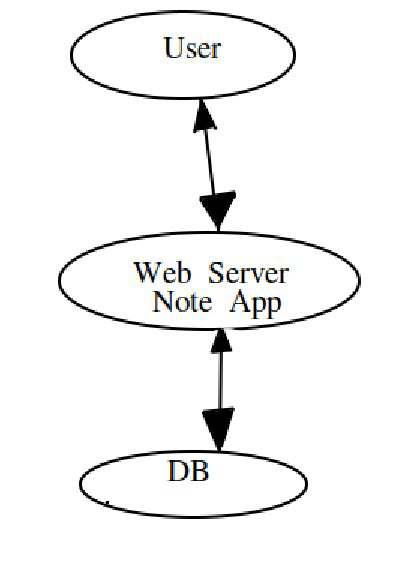
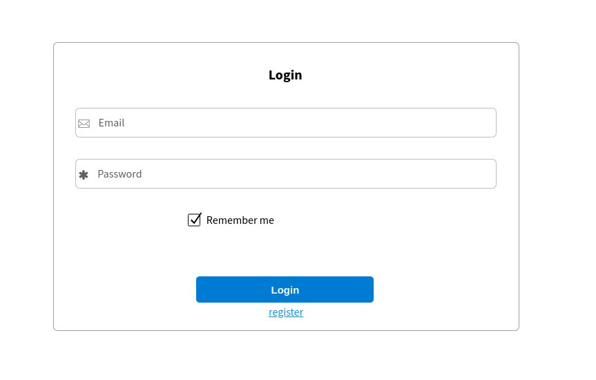
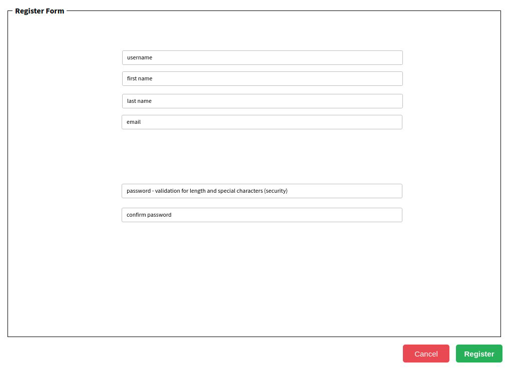
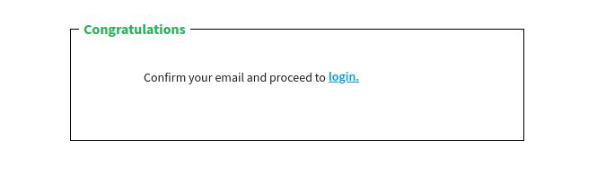
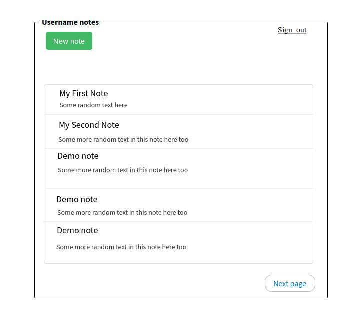
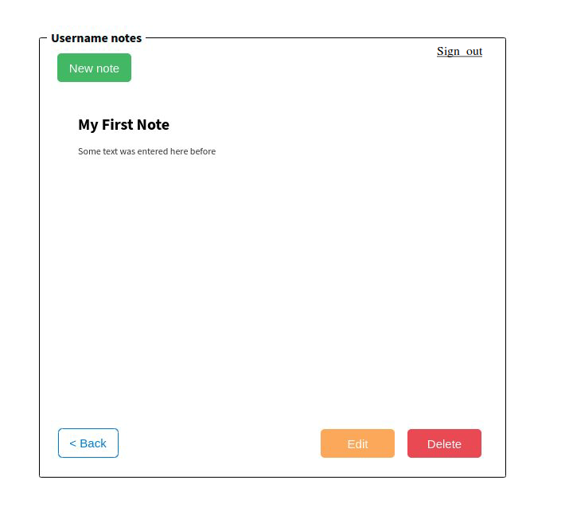
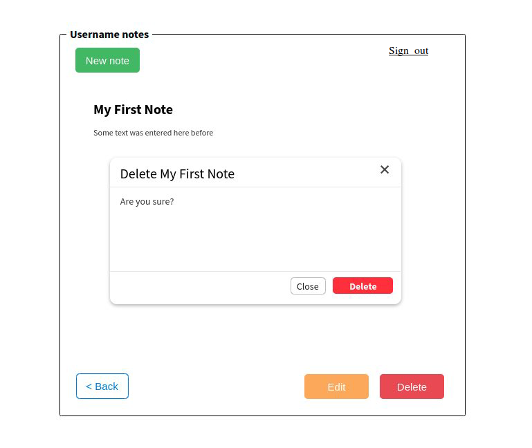
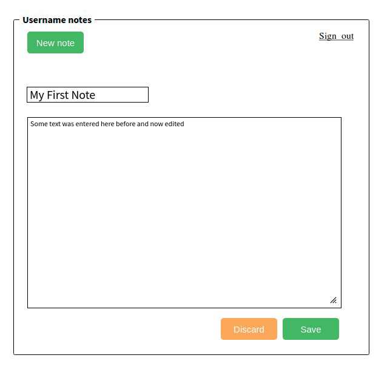
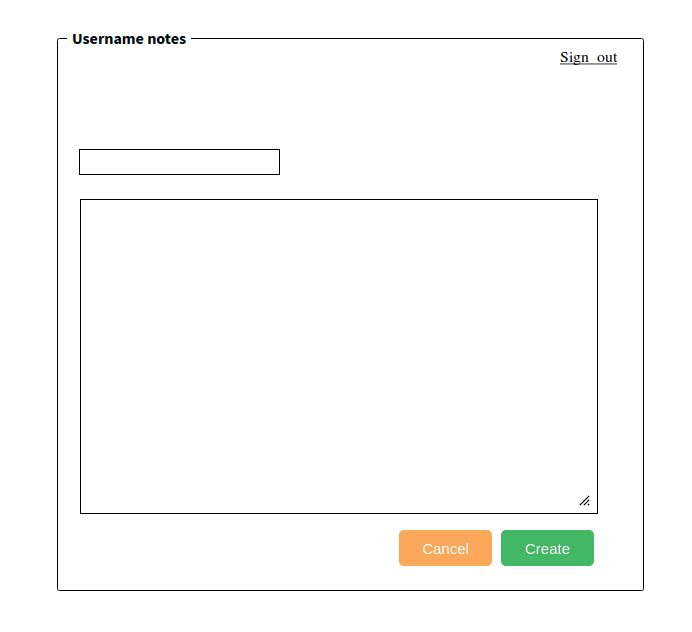

# Note App
##### A simple note web app, where a user can write a note, save a note, view a list of their notes, and delete a note. The user’s notes are saved so that they are available via any web-capable device.

### High Level Design
The user will communicate with the Note App using the web browser ui.From the browser the user will send (http) request and
will receive (http) responses.  

### Web App UI
1) The login screen for entering users credentials or register.
- Validate non empty email input
- Validate non empty password input

2) If the user doesn't have registration he can make one from the registration form.
- Validate username (not empty, format and not registered)
- Validate first and last name (not empty and letters only)
- Validate email (not empty and format)
- Validate password (the two passwords are matching and format)

3) On successful registration the user will receive a confirmation mail and can proceed.

4) When the user is logged he can see a paged list of his notes (if the list is not empty).

5) This is how a note looks like when the user select it.

6) If the user wants to delete a note he must click the delete button and after that a modal dialog will appear on the screen to confirm his action

7) If user want to edit certain note he can do so by pressing edit button. After that he can save or discard the changes he made.
- Validate no empty content

8) If the user wants to create a new note he can do so by click the "New note" button and a create note form will appear on the screen. After filling the form the user can choose to save it or not.
- Validate no empty content

 **Feature - implement a searching

### Data Model
Note

    ---------------
    id:Long        |
    ---------------|
    creator:Long   |
    ---------------|
    title:String   |
    ---------------|
    content:String |
    ---------------|
    created:Date   |
    ---------------|
    isDeleted:Bool |
    ---------------

### Rest API
 Method/Verb | URL| Description
 ------------|-----|----|
 POST   | /rest/api/1.0/note     | Creates new Note
 GET    | /rest/api/1.0/note     | Returns list of all Notes
 GET    | /rest/api/1.0/note/{id}| Returns a specific Note
 PUT    | /rest/api/1.0/note/{id}| Updates a specific Note
 DELETE | /rest/api/1.0/note/{id}| Deletes a specific Note

### Web Server
 By creating Spring Boot based web application we will use embedded Tomcat with web dependency and run the app on
 our machine or on any cloud service provider (Heroku, AWS, GCP, Azure).In case we want to persist the data on a 
 database (PostgreSQL, MySQL) we can configure the application with Spring Data or we can use H2 (in memory)